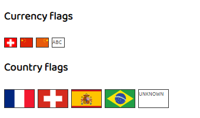

# flag-cc

<flag-cc> is a simple web component that display the flag of the
corresponding currency or country code.  Use the `currency` attribute to
display the currency flag or use `code` to display the country flag.

If the flag is not found, it will displays either the `currency` or the
`code` that was specified by the user.



## Installation and demo
This library depends on the famous LitElement library. To see the demo
locally in action please:

```
git clone https://github.com/yveslange/flag-cc.git
cd flag-cc && npm install
npm start
```

You can build the source by running `npm run build`. The built distribution
will be located into `./build/`.


## How to use

In your `index.html`:
```
  <head>
    <script src="./node_modules/@webcomponents/webcomponentsjs/webcomponents-loader.js"></script>
    <script type="module" src="./node_modules/flag-cc/index.js"></script>
```

Then you should be able to use \<flag-cc\> tag anywhere.
```javascript
<flag-cc currency="CHF"></flag-cc>
<flag-cc currency="CNY"></flag-cc>
<flag-cc currency="CNH"></flag-cc>
<flag-cc currency="ABC"></flag-cc>
<flag-cc code="Unknown"></flag-cc>
<flag-cc code="FR"></flag-cc>
```

## Technical
The flags will be searched in `./node_modules/flag-cc/flags/`. If you want to
change the path please refer to the property `imagesPath`.

## Example

```javascript
index.html
```

## Properties

| Property     | Attribute     | Type      | Default                         | Description                                      |
|--------------|---------------|-----------|---------------------------------|--------------------------------------------------|
| `code`       | `code`        |           |                                 | The country code (eg: CH, FR, ...)               |
| `country`    | `country`     |           |                                 | The corresponding country name                   |
| `currency`   | `currency`    |           |                                 | The currency code (eg: EUR, CNY, CHF, ...)       |
| `flagType`   | `flag-type`   | `string`  |                                 | The type of the flag ('country' or 'currency')   |
| `imagesPath` | `images-path` | `string`  | "./node_modules/flag-cc/flags/" | Configures where the images folder is located    |
| `isUnknown`  | `is-unknown`  | `boolean` |                                 | Is true if the country or currency code is unknown. This is set by<br />flag-cc if the flag was not found. |

## Methods

| Method            | Type                         | Description                                      |
|-------------------|------------------------------|--------------------------------------------------|
| `getCountryFlag`  | `(code?: string): String`    | Retreive the country flag using the code<br /><br />**code**: The country code. |
| `getCurrencyFlag` | `(currency: string): String` | Retreive the currency flag using the currency name.<br /><br />**currency**: The currency name to use (eg: CHF, EUR, ...). |
